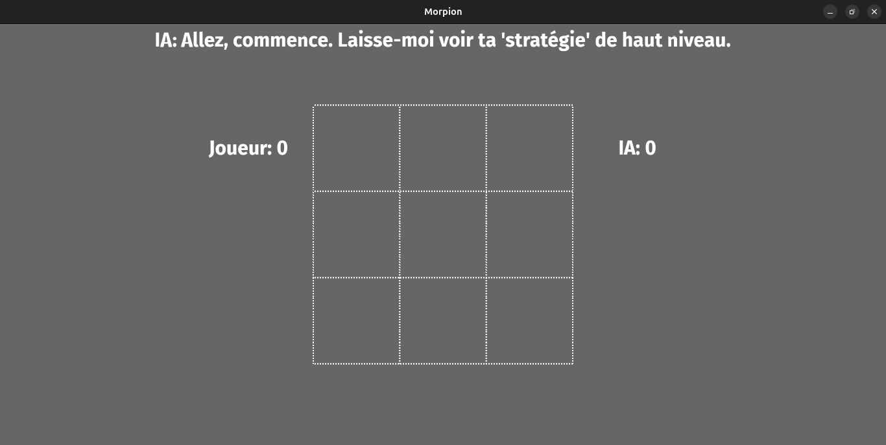
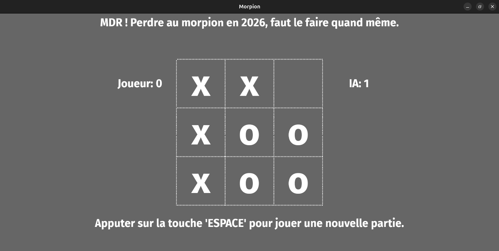
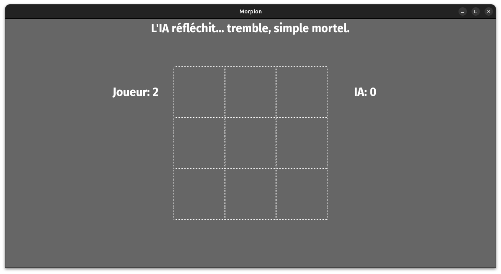
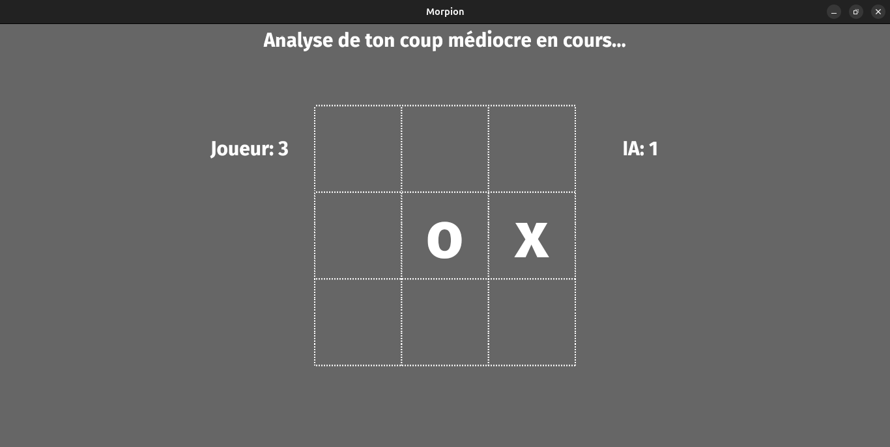
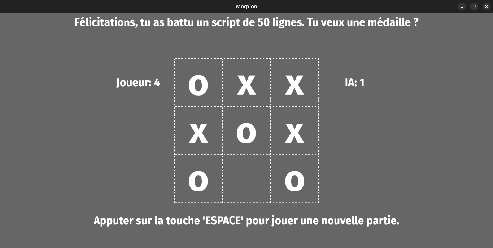
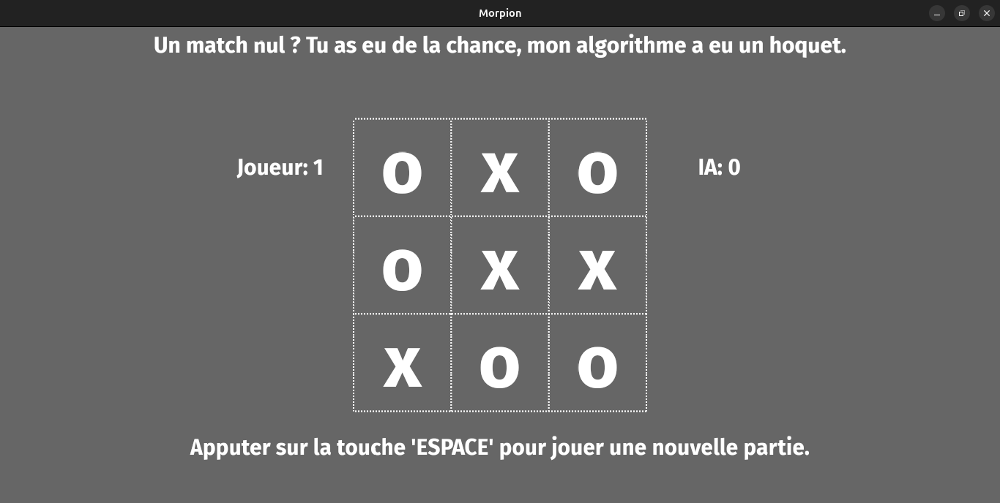

# ❌ Morpion (Tic-Tac-Toe) - Rusty Engine ⭕

Un jeu de Morpion ultra-fluide développé en **Rust** avec le moteur **Rusty Engine**. Ce projet a été conçu dans un but purement pédagogique pour maîtriser les concepts fondamentaux du développement de jeux vidéo, la manipulation bas niveau de la boucle de jeu, et l'implémentation d'une IA au caractère... bien trempé.

> **Avertissement :** L'IA intégrée n'a aucun respect. Que vous gagniez, que vous perdiez, ou que vous fassiez un match nul, elle trouvera toujours une punchline pour vous vanner. Vous êtes prévenus.

---

## 📸 Aperçu du Projet

Voici à quoi ressemble le jeu en action :







---

## 🚀 Objectifs Pédagogiques & Techniques

Ce projet va bien au-delà du simple jeu de Morpion. Il a servi de laboratoire pour explorer plusieurs piliers du développement de jeux en Rust :

* **Maîtrise de Rust :** Apprentissage de la gestion de la mémoire, de la sécurité des types et de la rigueur du compilateur Rust.
* **Architecture de Jeu :** Compréhension globale du fonctionnement d'un moteur de jeu (Game Loop, Input Management, et rendu de Sprites).
* **Mathématiques Appliquées :** Gestion des systèmes de coordonnées pour mapper les clics de la souris de l'écran vers la grille logique du Morpion.
* **Fluidité & Gestion des FPS :** Manipulation fine du Delta Time ($\Delta t$) dans la boucle de jeu pour garantir des animations et des transitions parfaitement fluides (60 FPS+), peu importe la puissance de la machine qui exécute le jeu.

---

## 🧠 L'IA "Trash-Talker"

Derrière les répliques cinglantes du jeu se cache un système de décision au design épuré, optimisé pour l'imprévisibilité :

* **Sélection Tactique Organique :** L'IA analyse l'état du plateau en temps réel pour identifier instantanément les opportunités. Grâce à un algorithme de probing non-linéaire (une boucle de recherche dynamique), elle explore l'espace des possibles et sélectionne avec une vitesse fulgurante la case idéale pour contrer vos ambitions.
* **Générateur d'Humeur Contextuel :** Pas de froide logique robotique ici. L'IA adapte son attitude à l'issue de la partie. Une fois le verdict tombé, elle puise de façon totalement fluide et asynchrone dans une bibliothèque de répliques acérées. Que le hasard vous favorise ou que vous succombiez à sa stratégie, elle aura toujours le mot (très) blessant pour ponctuer la fin de la partie.

**Si vous perdez :** Elle remet en question votre logique élémentaire.

**Si vous gagnez :** Elle prétendra qu'elle vous a laissé gagner par pitié.

**Match nul :** Elle vous fera comprendre que vous avez tous les deux perdu du temps.

---

## 🛠️ Installation et Exécution

### Prérequis

Avoir installé la toolchain Rust sur votre machine (via [rustup](https://rustup.rs/)).

### Lancer le jeu

1. Clonez le dépôt :
   ```bash
   git clone https://github.com/MarShell237/morpion.git
   cd morpion
   cargo run --release
